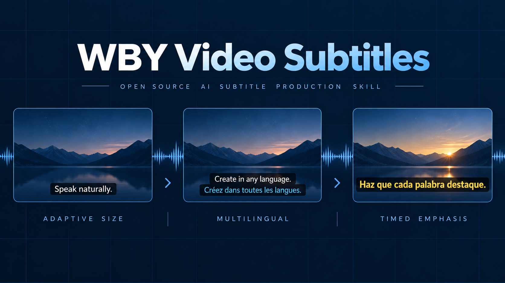
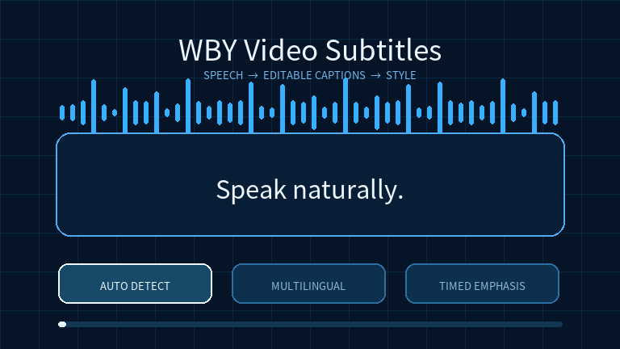

# WBY Video Subtitles

[英語](README.md) · [中国語（簡体）](README.zh-CN.md) · **日本語**



`WBY Video Subtitles` は、特定の入力言語に限定されず、さまざまな Agent から呼び出せるローカル Skill です。動画の音声または既存字幕から編集可能な字幕を作成し、ASS/SRT の生成、レイアウト確認、プレビュー、字幕の焼き込みまで行います。

トーク動画や画面収録を繰り返し制作する用途を想定しています。動画ごとに独立したジョブを作成し、それぞれのスタイル、用語集、改訂履歴を保持します。

## 一つのワークフロー、三つの成果

| 機能 | できること |
|---|---|
| 自動サイズ調整 | 選択したフォントと実際の画面を測定し、二行の安全領域に字幕を収めます。 |
| 多言語の二言語表示 | 入力言語を自動検出または指定し、確認済みの原文と翻訳を二行で測定して配置します。 |
| 時間指定の強調 | 確認済みのタイムラインに合わせ、重要な言葉の字幕を拡大または色変更します。 |

<details>
<summary>アニメーションを見る</summary>



</details>

生の文字起こしと確認済みの `captions.json` は分けて保存します。用語修正は根拠とともに記録され、バージョン付き SRT、ASS、プレビュー、完成 MP4、確認レポートを出力します。二行に安全に収まらない文字は、黙って切り捨てません。

## 内蔵フォントとサイズプリセット

SIL Open Font License 1.1 の `Noto Sans CJK SC Regular` を同梱し、一般的なラテン文字と CJK の用途をカバーします。フォントの優先順位は、`--font`、任意のマシン設定、同梱フォントです。アラビア文字、デーヴァナーガリーなど同梱フォントにない文字体系では、対応フォントを指定してください。事前検査は未対応文字を拒否し、豆腐文字のまま出力しません。

| プリセット | 基本文字サイズ | 最小サイズ | 翻訳行 | 推奨用途 |
|---|---:|---:|---:|---|
| `compact` | フレーム高の 4.0% | 3.2% | 基本文字の 76% | 情報量の多い画面収録 |
| `standard` | 4.5% | 3.5% | 78% | 標準のトーク・デモ動画 |
| `emphasis` | 5.2% | 4.0% | 80% | 短く強調したい字幕 |

`standard` は高さ 1080 の動画で約 49 px、高さ 2160 で約 97 px から始まります。長い字幕はプリセットの最小値まで縮小され、それでも二行に収まらない場合は分割と再タイミングを求めます。

## 必要環境

- Python 3.12 推奨。
- `ass`/libass フィルターと `libx264` を備えた FFmpeg。
- 同梱フォント、または使用許可のある `.ttf`/`.otf` フォント。
- `requirements.txt` に記載された Python パッケージ。
- 音声認識には、Apple Silicon では `mlx-whisper`、その他の環境では個別に検証した `faster-whisper` 構成。

## Skill をインストールする

### Agent にインストールを依頼する

ローカルファイルとターミナルを操作できる Agent に、次のプロンプトをコピーして送信してください。

```text
リポジトリの SKILL.md に従って、この Skill をインストールしてください。
https://github.com/SuperWBY/wby-video-subtitles
```

インストール、依存関係の設定、更新、検証の手順は [Skill](SKILL.md#installation-and-updates) に含まれています。

### 手動インストール

使用する Agent のドキュメントで Skill ディレクトリを確認し、その場所へリポジトリをクローンするか、同梱インストーラーにその親ディレクトリを渡してください。リポジトリは自己完結しており、既存のコピーは上書きしません。

### Codex の例

Codex で設定した Skill ディレクトリにクローンします。

```sh
git clone https://github.com/SuperWBY/wby-video-subtitles.git ~/.codex/skills/wby-video-subtitles
```

別の Agent に導入する場合は、そのクライアントが指定する Skill の親ディレクトリを確認してからインストーラーを実行します。

```sh
python3 scripts/install.py --target /absolute/path/to/that-agent/skills
```

インストールだけでは、その Agent が Skill を検出して実行できたことの証明にはなりません。[英語の互換性ガイド](references/compatibility.en.md)に従って確認してください。

ローカル仮想環境と依存関係を準備します。

```sh
python3 -m venv ~/.local/share/wby-video-subtitles/venv
~/.local/share/wby-video-subtitles/venv/bin/python -m pip install -r ~/.codex/skills/wby-video-subtitles/requirements.txt
~/.local/share/wby-video-subtitles/venv/bin/python -m pip install mlx-whisper
```

## クイックスタート

```sh
PY=~/.local/share/wby-video-subtitles/venv/bin/python
SKILL=~/.codex/skills/wby-video-subtitles/scripts/subtitles.py

$PY $SKILL doctor
$PY $SKILL init --video /absolute/path/video.mp4 --job /absolute/path/video-job --language auto --preset standard
```

`--language auto` は入力言語を自動検出します。明示する場合はバックエンドが対応する `en`、`fr`、`zh`、`ja`、`pt` などのコードを指定します。`--preset compact` または `--preset emphasis` も選択できます。同梱フォントを変更する場合は `--font /absolute/path/font.otf` を追加します。

文字起こし、確認、準備、プレビュー、レンダリングを行います。

```sh
$PY $SKILL transcribe --job /absolute/path/video-job
# captions.json を元音声と照合してから続行します。
$PY $SKILL apply-terms --job /absolute/path/video-job --json /absolute/path/reviewed-corrections.json
$PY $SKILL import-translations --job /absolute/path/video-job --json /absolute/path/reviewed-translations.json
$PY $SKILL prepare --job /absolute/path/video-job
$PY $SKILL preview --job /absolute/path/video-job --start 0 --seconds 8
$PY $SKILL render --job /absolute/path/video-job
```

既存の字幕がある場合は新しいジョブを作成し、`transcribe` の代わりに次を実行します。

```sh
$PY $SKILL import-srt --job /absolute/path/video-job --srt /absolute/path/captions.srt
```

## 出力と確認

`prepare` を実行するたびに `job/revisions/` の下へ新しい改訂版を保存し、`latest.json` を更新します。以前の改訂版と確認済み字幕は上書きされません。

公開前に、冒頭、最長字幕、専門用語の多い部分、二言語部分、スタイル効果のある部分を確認してください。レンダリング成功は、ファイルがデコードでき音声ストリームが存在することを示しますが、意味、翻訳、同期の正確さを保証しません。

## 検証

```sh
PY=~/.local/share/wby-video-subtitles/venv/bin/python
$PY ~/.codex/skills/wby-video-subtitles/scripts/self_test.py
```

設定項目、用語修正、二言語字幕、時間指定効果の詳細は [英語の設定ガイド](references/usage.en.md) を参照してください。Agent 間の対応範囲は [英語の互換性ガイド](references/compatibility.en.md)、実測済みの範囲は [英語の検証記録](references/validation.en.md) に記載しています。

## ライセンス

コードは MIT License です。[LICENSE](LICENSE) を参照してください。同梱 Noto フォントには SIL Open Font License 1.1 が適用されます。[フォントライセンス](assets/fonts/LICENSE.txt) を参照してください。
